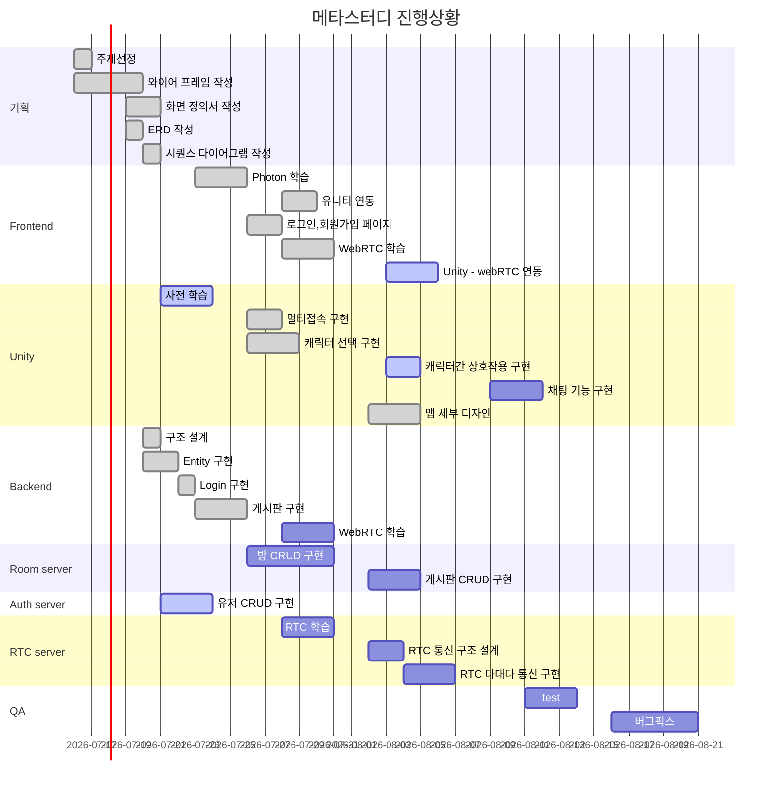
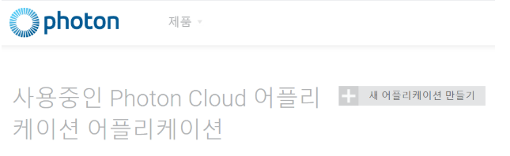

# [MetaStudy]

#### 배포서버 : https://i5b105.p.ssafy.io/




## 서론

> 주제 선정 및 방향성 이야기

### 주제

- 메타버스를 활용한 코딩 스터디용 플랫폼 
- 유니티를 활용하여 2D 맵에서 이동, 일정 거리이상 가까워져 캐릭터간 접촉시 화상 채팅 가능
- 알고리즘 문제 사이트 등을 바로 이어주는 기능을 활용하여 알고리즘 공부스터디에 적극 활용 가능하도록 함


### 도입 이유

코드 공유 및 서로의 화면을 보여주는 일이 많은 프로그래밍 비대면 스터디를 진행하면서, 어떻게 하면 온라인의 한계를 허물고 더욱 친밀감을 느끼면서 공부를 하고 싶다는 생각을 했습니다. 전국적으로 코딩에 대한 관심이 많아지고, 그에 따라 다양한 코딩 비대면 스터디가 활발함에 따라 "예비 개발자"들만을 위한, 빠져나올 수 없는 "개발의 늪"을 만들어 그들에게 즐거운 스터디 시간을 제공하고 싶었습니다.

우리의 메타 스터디와 함께, 우리들도 그리고 전국의 모든 예비 개발자들도 "판교 주민들"이 되서, 백현동 카페거리에서 만나는 그날까지 즐거운 실력 상승을 보내면 합니다!

## SUB 2 - Week 1 (07.19-07.25)

> 유니티 학습과 백앤드 기본구현 진행 기간

### :computer: 백엔드 진행사항

- 기능명세서 기술(notion)
- Entity 구현(Room, User, Board, Conference, User_Conference,User_Room)및 Diagram 생성
- Springboot와 MySql JPA를 이용하여 연동
- Swagger2 구현
- 회원관리(로그인-jwt토큰인증방식, 회원가입, 탈퇴, 조회, 수정, 중복검사, id반환) 기능 구현


#### :boxing_glove: 프론트엔드 진행사항

- Unity Sprite 컨셉 기획 및 선정
- Unity 애니메이션 학습
- Unity Rule Tile 학습
- 어몽어스 클론 코딩을 통한 Photon, Mirror등의 multi user 기능 구현 학습
- Photon 2를 통한 Multi room 개설 학습


## SUB2 - Week 2(07.26~07.31)

### :computer: 백엔드 진행사항

- WebRTC학습
- docker, WSL환경에서 OpenVIdu서버 구동
- 화상채팅 기본구현


###  :boxing_glove: 프론트엔드 진행사항

#### :game_die: Unity 구현

1. 닉네임 입력 후, Photon 서버 접속 구현

   - Photon 패키지, 라이브러리, 서버를 이용하여 서버 연동 및 접속 가능

     

2. 방 생성/참가 및 로비 내에서 방 리스트 구현

   - Photon 내 메서드를 이용하여 방 구현 및 참가 구현 (서버 접속 후 생성 및 참여 가능)

3. 캐릭터 선택 구현

   - 캐릭터 오브젝트 별 프리팹을 활용

   - Data를 저장해 두는 object를 생성 후, 데이터(어떤 캐릭터를 선택했는지)를 저장해 둘 수 있도록 한다.

4. 멀티플레이어 방 접속 및 플레이어 이동 구현

   - Photonview 및 Photonview.RPC를 이용한 네트워크 동기화

5. 플레이어 - 오브젝트 간 상호작용 구현

   - Debugdraw - Raycast를 활용하여 오브젝트와의 접촉을 인식한다.

   - 오브젝트마다 scripts 내에 자신의 정보를 저장하여 접근하여 서로간의 정보를 확인한다.

6. 캐릭터 선택창에 애니메이션 기능과 배경색으로 선택된 캐릭터와 선택되지 않은 캐릭터 구분하기

7. 선택된 캐릭터를 다른 씬으로 이동시키기

#### :cactus: Vue 구현

element-ui로 UI Library사용.

1. 로그인 구현

   element-ui의 form에서는 `props`, `rules`를 통해서 해당 하는 것의 규칙을 정해주고,
   
   ```javascript
   method이름(검증할폼){
   
   ​	this.$refs[검증할폼].validat((valid))}
   ```
   
   의 구조를 활용해서 검증한다. 
   
2. 회원가입 구현

3. 회원정보 수정/ 삭제 구현 (Profile 페이지)

4. town 페이지(유니티 보여질곳) 생성

5. Unity를 webGl로 실행

6. Unity 실행 시점을 조절하고 Unity의 화면이 나타날 공간 조절하는 법을 공부중

## SUB2 - Week 3(08.01~08.20)

### 화상구현

- OpenVidu를 통한 WebRTC 기술 활용 및 화면 공유 설정 적용
- Unity 내에서 화상 공유 요청을 시작해야하기 때문에 **작동 원리 파악 이슈** 발생
  - 예상 개발 시간보다 늦어지는 계기
- Unity와 Vue / Unity와 Backend **소통 방법을 파악하는 어려움** 발생
  - 예상 개발 기간보다 늦어지는 계기
- 화상 연결의 원리 파악 및 기능 구현
  - 보안해야할 점 : openvidu에서 제공하는 틀 내에서 구현해야하기에 구현에 제한적

### 채팅구현

- Unity 자체 채팅방 및 화면공유 시 채팅 기능 활성화

### 배포

- Ubuntu(linux) AWS 제공 서버 내에 배포 진행

- 서버 내 Front / Back을 받아온 후, 빌드하여 배포 진행

  - 보안해야할 점 : Jenkins를 활용하여 매번 빌드하는 것이 아닌 즉각 적용 개발 필요

  
