# MetaStudy

> 비대면 시대에 혼자 학습하는 개발자를 위한 WebRTC 개발자 스터디 플랫폼 

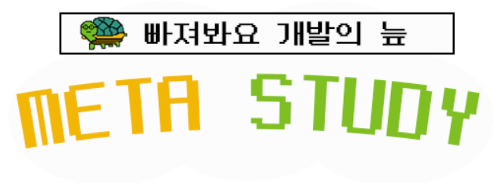

#### 팀명 : 판교주민들             프로젝트기간 : 7/12~8/20

#### 배포서버 : https://i5b105.p.ssafy.io/

유니티파일 : https://github.com/kangjunluck/MetaStudyUnity

[ERD](/산출물/산출물/B105_ERD.PNG)

[시퀀스다이어그램](/산출물/산출물/B105_시퀀스다이아그램.jpg)

[화면정의서_Figma](/산출물/산출물/메타스터디_화면정의서_Figma.pdf)

[화면정의서](/산출물/산출물/B105_화면정의서.pdf)

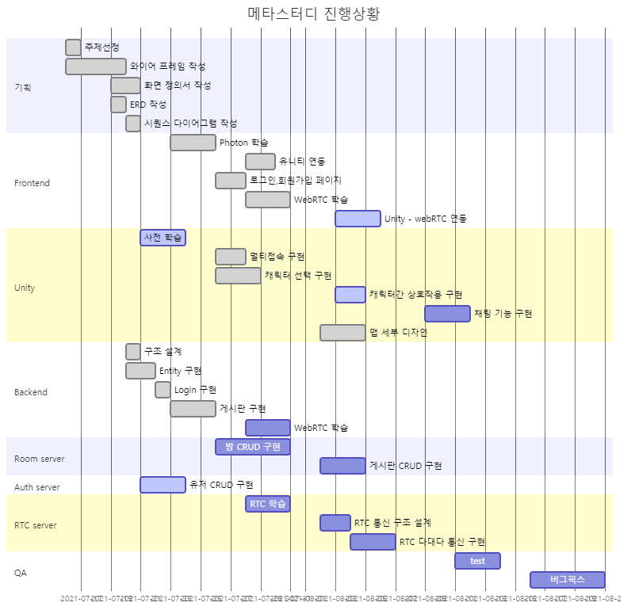

### 주제

- **메타버스**를 활용한 개발 스터디용 플랫폼 
- 유니티를 활용하여 2D 맵에서 이동, 일정 거리이상 가까워져 **캐릭터간 접촉시 화상 채팅 및 단체 채팅 기능 구현**
- **알고리즘 문제 사이트 등을 바로 이어주는 기능**을 활용하여 알고리즘 공부스터디에 적극 활용 가능하도록 함

### 도입 이유

코드 공유 및 서로의 화면을 보여주는 일이 많은 프로그래밍 비대면 스터디를 진행하면서, 어떻게 하면 온라인의 한계를 허물고 더욱 친밀감을 느끼면서 공부를 하고 싶다는 생각을 했습니다. 전국적으로 코딩에 대한 관심이 많아지고, 그에 따라 다양한 코딩 비대면 스터디가 활발함에 따라 "예비 개발자"들만을 위한, 빠져나올 수 없는 "개발의 늪"을 만들어 그들에게 즐거운 스터디 시간을 제공하고 싶었습니다.

우리의 메타 스터디와 함께, 우리들도 그리고 전국의 모든 예비 개발자들도 "판교 주민들"이 되서, 백현동 카페거리에서 만나는 그날까지 즐거운 실력 상승을 보내면 합니다!

### 기술 스택

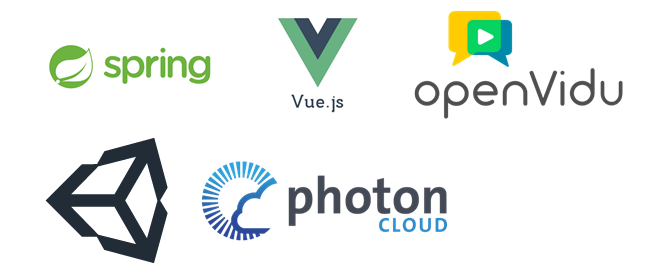

### 데이터베이스 모델링(ERD)

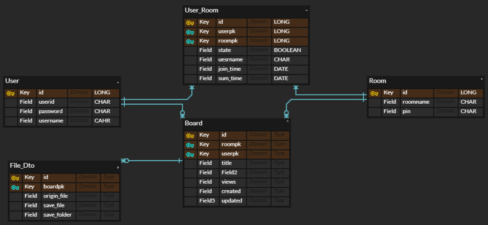

### :man_in_tuxedo:  팀내 나의 역할

Main : Unity , Front-end, Back-end

> 프로젝트 중 취업으로 인해 팀원이 나가고 이에 전 영역에 개발을 진행해야 했다. 

- Unity 전 개발
  - 게임 디자인
  - 게임 기능 구현
  - 유니티 http 통신 구현
- OpenVidu를 활용한 WebRTC 구현
- Vue - Unity 상호작용 구현
- Database modeling, backend 개발

### :computer: 실제 구현 정도

- 목표한 모든 기능 구현 완료
  1. 메타버스를 활용한 멀티 네트워크 서비스
     - 캐릭터간 상호작용, 움직임, 동기화 구현
  2. 화상 연결 및 채팅 기능 구현 (+ 단체 화상 기능)
  3. 알고리즘 사이트 이동 기능 구현
  4. 게시판, 공지 기능 구현
  5. 스터디 시간 기록 기능 구현

### :key: 기능 설명

> 로그인, 로그아웃, 회원 관리 기능 생략

#### 1. 캐릭터 선택

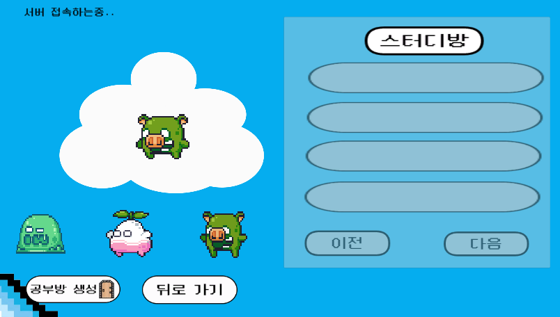

- 원하는 캐릭터를 선택하여 방을 만들거나 만들어진 방에 입장할 수 있다. (슬라임, 핑크무, 앵그리피그)
- 구현 방법
  - 유니티 내에서 로비 내 데이터를 저장해 둘 scripts를 만들고 선택시마다 선택된 캐릭터를 저장해둔다.
  - 방에 입장할 대 프리팹으로 만들어진 각 캐릭터들 중에 저장된 데이터와 맞는 것으로 생성한다.

#### 2. 방 생성

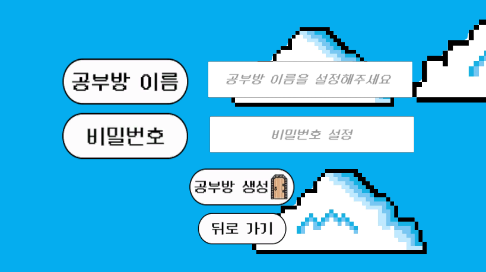

- 방 이름과 비밀번호를 입력하면 제공되는 photon cloud 를 통해 준비된 서버에 방을 만들고 참여할 수 있다.
- 구현 방법
  - 서버 접속 후 create메서드를 통해 방을 만들고 참가할 수 있다.
  - spring boot 내 DB로 방 정보와 비밀번호를 저장하여 비밀번호를 입력한 유저만 입장하도록 구현
  - unity에서 직접 backend로 요청을 보내고 응답을 받을 수 있다.

#### 3. 단체 화상 기능

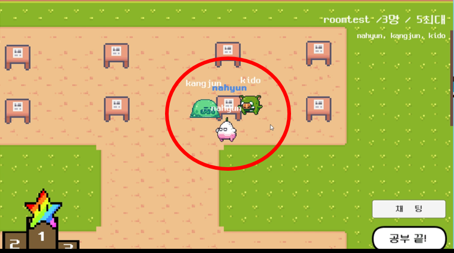

- 책상에 'c' 키를 누르면 화상 연결 메세지가 모달이 뜨고 승인 시, 책상에 이름이 새겨지고 화상 방을 생성하게 된다.
- 이름이 생성된 책상에 'c' 키를 누르면 생성된 화상 방에 입장하게 된다.
- 구현 방법
  - 책상 오브젝트 내 script에 이름을 저장할 수 있도록 text를 만들고 화상 생성시 해당 text에 플레이어의 이름이 저장되도록 구현

#### 4. 1:1화상 기능

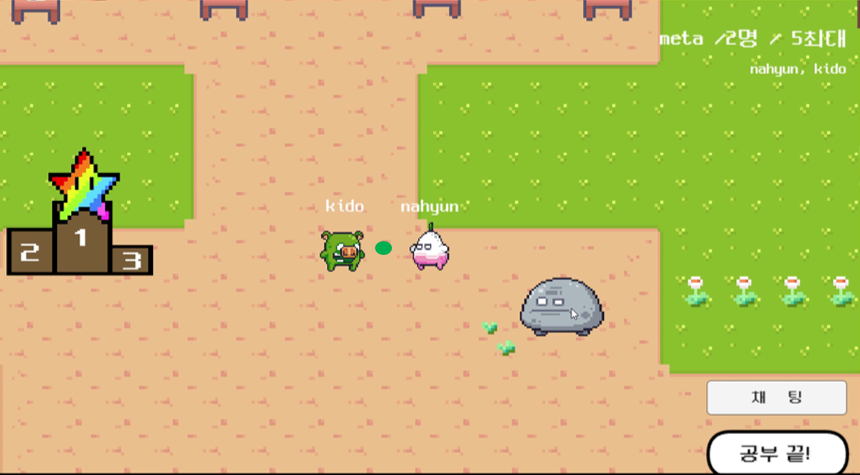

- 일정 거리 내에서 spacebar를 누르면 상대에게 초록색 구를 쏘면서 맞은 상대와 화상 채팅방이 생성
- 구현 방법
  - 프리팹 초록색 구를 만들어 쏠때마다 생성되도록 구현
  - 상대에게 맞거나 일정 시간이 지나면 삭제되도록 구현
  - 상대에게 맞았을 경우, 상대에게 쏜 사람의 이름을 알 수 있도록 하여 화상 방에 입장하도록 구현

#### 5. 랭킹 보드판

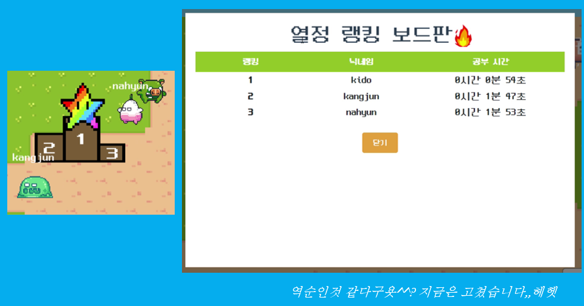

- 오래 접속(공부)한 순으로 닉네임을 볼 수 있다. 서로 경쟁으로 윈윈!
- 구현 방법 : 접속 시간, 누적 시간 DB를 만들어 나가고 들어갈 때마다 갱신해준다.

#### 6. 정보 게시판

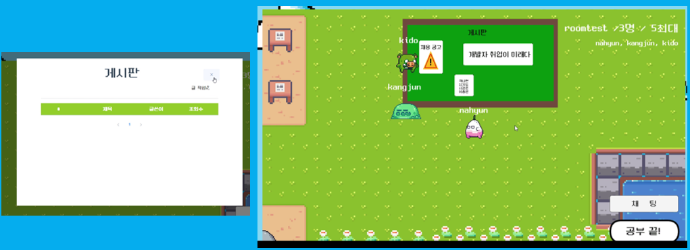

- 게시판 내에서 게시글을 작성, 수정, 삭제 등을 통해 정보를 공유할 수 있다.
- 구현 방법
  - 기존 게시판 기능을 유니티 내에서 'c'를 눌렀을 때 모달창으로 뜨도록 구현

#### 7. 알고리즘 사이트 이동

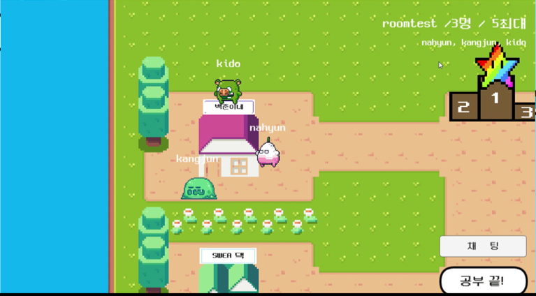

- 백준, SWEA 등 알고리즘 사이트 집을 만들어 해당 집에 상호작용 시, 해당 사이트로 이동하도록 구현
- 구현 방법
  - Unity의 http 통신 방법을 활용하여, 사이트 이동하도록 구현

### :fire: 난관

1. Unity 개발

   - C#을 처음 배우며 이 언어를 통해 개발을 진행해야 했기에 배우는 시간 및 이해하는 시간이 많이 필요했다.
   - Unity와 Vue, Unity와 Spring의 통신 방법 - 정보가 부족하고 여러 시행 착오 끝에 해결할 수 있었다.
   - Webgl 빌드 파일을 Vue 위에서 실행시키는 방법 - 정보가 부족하여 시행착오 및 질문, 그리고 코칭 덕분에 해결
   - 동기적 처리의 필요 - 순서대로 작동해야하는 게임 특성 상, 비동기식 함수 실행은 오류를 만들어 냈다.
     - startcoroutine, yield return 방식을 활용하여 해결할 수 있다.
   - 데이터 저장, 데이터의 이동 - 스크립트 내에 데이터를 저장해야하고 활용해 써야하는 경우가 많았다.
     - 변수를 만들어 데이터를 저장해 두면, scene이 바뀌지 않는 한 데이터는 유지된다. scene이 바뀌더라도 유지하도록 설정할 수 있다.
   - build시 발생하는 오류 - 어느 부분이 문제인지 unity는 불친절하여 확인할 수 없다.
     - 전 scripts를 다 확인하며 어떤 부분이 문제인지 확인해야한다.

2. 배포 문제

   - openvidu webRTC를 위한 서버를 다른 포트로 정해둬야한다. 기존 배포 서버를 같은 주소로 정하면 작동하지 않는다.
   - SSL 인증하기 - SSL 인증하지 않으면, 보안 문제가 발생한다. 매번 접속시 http로 접속되며 보안상 위험한 사이트가 된다.
     - Let's Encrypt에서 보안서를 무료로 발급받을 수 있고 pem > key로 바꾼 후, 각 서버에 key를 등록해준다.

   - Back port, Front port, Openvidu port를 모두 다르게 설정해야한다!

   

